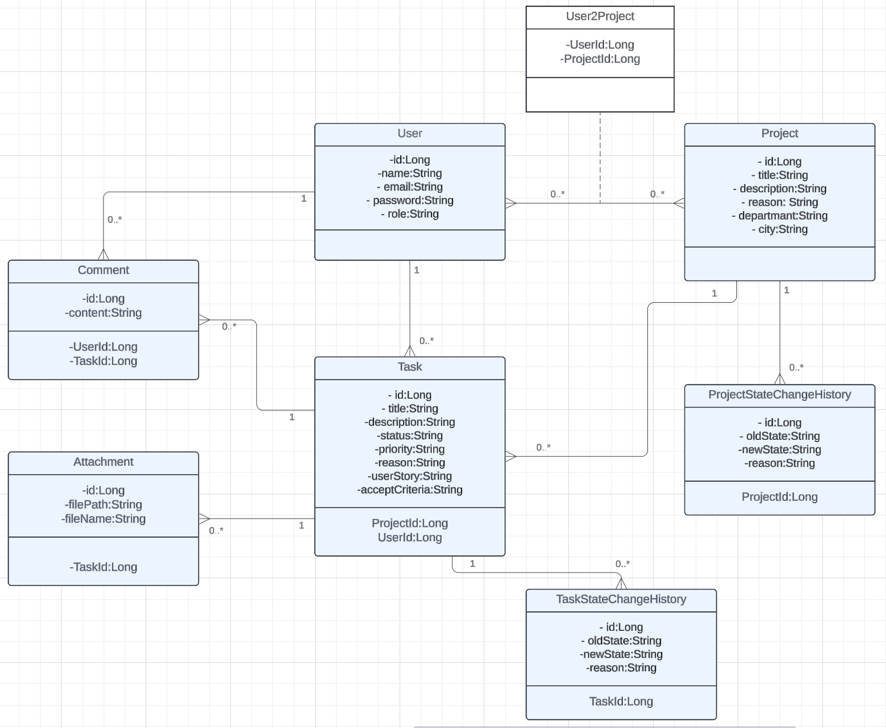

# Advanced Task Management System

## 📘 Project Overview

Lorem Ipsum Corporation has decided to replace its legacy task manager system due to outdated technology, poor performance, and insufficient functionality. After a detailed analysis of alternative tools, the company board has decided to build an in-house **Advanced Task Management System**.

This application aims to provide comprehensive project and task management features, with robust team collaboration and tracking capabilities.

This project is a task management system developed with Java Spring Boot. Complete with Redis Cache, Swagger UI, Role-Based Authorization, JWT Authentication and Docker support.

---

## 🚀 Key Features

- **Project and Task Management**
    - Manage projects associated with departments.
    - Create, update, and track tasks under each project.

- **Team Member Assignment**
    - Assign team members to tasks.
    - Role-based assignment by Team Leaders or Project Managers.

- **Progress Tracking**
    - Track task progress with defined states:
        - `Backlog`, `In Analysis`, `In Development/Progress`, `Blocked`, `Cancelled`, `Completed`

- **Priority Management**
    - Set task priority levels:
        - `Critical`, `High`, `Medium`, `Low`

- **File Attachment Support**
    - Attach one or more files to a task.
    - Files are stored on disk.

- **Commenting**
    - Add comments to tasks for better collaboration.

---

## ⚙️ Task State Transition Rules

### ✅ Happy Path

- `Backlog ⇄ In Analysis ⇄ In Development/Progress ⇄ Completed`


### ❌ Cancel Path
- A task can be marked as **Cancelled** in any state except **Completed**.
- Reason must be provided for **Cancelled** state.

### 🚫 Blocked Paths
- `In Analysis ⇄ Blocked`
- `In Development/Progress ⇄ Blocked`
- Reason must be provided for **Blocked** state.

### ⚠️ Constraints
- Once a task is marked as **Completed**, it cannot be moved back to any other state.

---

## 🔒 Role-Based Access Rules

| Role             | Change Title/Description | Change State | Add Comments | Manage Attachments |
|------------------|--------------------------|--------------|--------------|---------------------|
| Team Member       | ❌ Not Allowed            | ✅ Allowed   | ✅ Allowed   | ✅ Allowed          |
| Team Leader/PM    | ✅ Allowed                | ✅ Allowed   | ✅ Allowed   | ✅ Allowed          |

---

## 🧪 Testing & Quality Standards

- **Unit Tests** implemented.
- **Code Coverage** was at least **80%**, as per corporate quality standards.

---

## 💻 Tech Stack

- **Java 21**
- **Spring Boot 3**
- **Maven**
- **PostgreSQL**
- **JUnit** for testing
- **Docker** for Redis
- **SwaggerUI**
- **Jacoco**

---

## 🔥 Setup Steps

### 1. Cloning repo
```bash
git clone https://github.com/senin-kullanicin/advanced-task-manager.git
cd advanced-task-manager
```

### 2. Start redis with Docker
```base
docker-compose up -d
```
### 3. Compile and start project
```bash
mvn clean install
mvn spring-boot:run
```
### 4. Open Swagger UI
```
http://localhost:8080/swagger-ui.html
```

### 5. API Document
```
http://localhost:8080/v3/api-docs
```
### 6. Open Jacoco
```
http://localhost:63342/advancedTaskManagement/target/site/jacoco/index.html
```
---
## 🔐 Admin Login Information
```
E-mail: admin@admin.com
password : admin
```
---

## 📊 UML Diagram

> 


---

## 📬 API Endpoints

| HTTP Method | Endpoint            | Description            |
|-------------|---------------------|------------------------|
| GET         | `/v1/projects`      | Get all projects       |
| POST        | `/v1/projects`      | Create a new project   |
| GET         | `/v1/projects/{id}` | Get project by ID      |
| PUT         | `/v1/projects/{id}` | Update project by ID   |
| DELETE      | `/v1/projects/{id}` | Delete a project by ID |

---

| HTTP Method | Endpoint                                               | Description                                    |
|-------------|--------------------------------------------------------|------------------------------------------------|
| GET         | `/v1/project-state-change-history/project/{projectId}` | Get all project change histories by project ID |

---

| HTTP Method | Endpoint                 | Description                         |
|-------------|--------------------------|-------------------------------------|
| GET         | `/v1/tasks`              | Get all tasks                       |
| POST        | `/v1/tasks`              | Create a new task                   |
| GET         | `/v1/tasks/{id}`         | Get task by ID                      |
| PUT         | `/v1/tasks/{id}`         | Update tasks by ID                  |
| DELETE      | `/api/tasks/{id}`        | Delete a task by ID                 |
| GET         | `/v1/tasks/user/{id}`    | Get task by user ID                 |
| GET         | `/v1/tasks/project/{id}` | Update tasks by project ID          |
| PATCH       | `/v1/tasks/{id}`         | Update just task state a task by ID |

---

| HTTP Method | Endpoint                                      | Description                               |
|-------------|-----------------------------------------------|-------------------------------------------|
| GET         | `/v1/task-state-history/project/{projectId}`  | Get all tasks change histories by task ID |

---

| HTTP Method | Endpoint         | Description         |
|-------------|------------------|---------------------|
| GET         | `/v1/users`      | Get all user        |
| POST        | `/v1/users`      | Create a new user   |
| GET         | `/v1/users/{id}` | Get user by ID      |
| PUT         | `/v1/users/{id}` | Update user by ID   |
| DELETE      | `/v1/users/{id}` | Delete a user by ID |

---

| HTTP Method | Endpoint                                  | Description                          |
|-------------|-------------------------------------------|--------------------------------------|
| POST        | `/v1/attachments/upload/{taskId}`         | Upload attachments by task ID        |
| GET         | `/v1/attachments/download/{attachmentId}` | Download attachment by attachment ID |
| GET         | `/v1/attachments/task/{taskId}`           | Get attachments by task ID           |

---

| HTTP Method | Endpoint                     | Description                     |
|-------------|------------------------------|---------------------------------|
| GET         | `/v1/comments/task/{taskId}` | Get all comments by task ID     |
| POST        | `/v1/comments/task/{taskId}` | Create a new comment by task ID |
| DELETE      | `/v1/comments/{commentId}`   | Delete comment by ID            |

---
